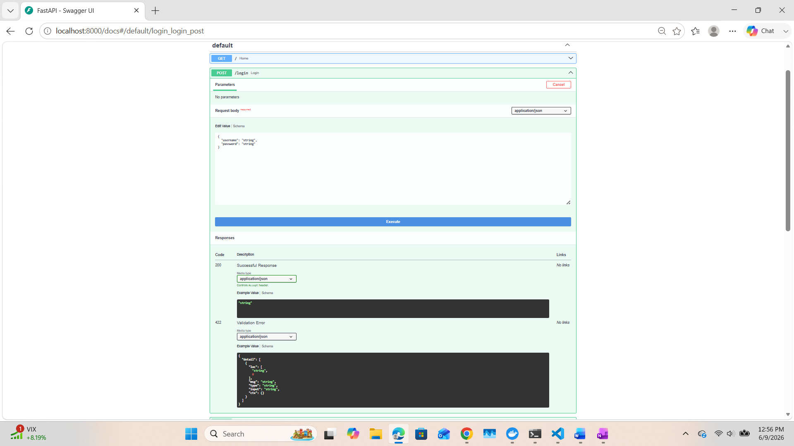
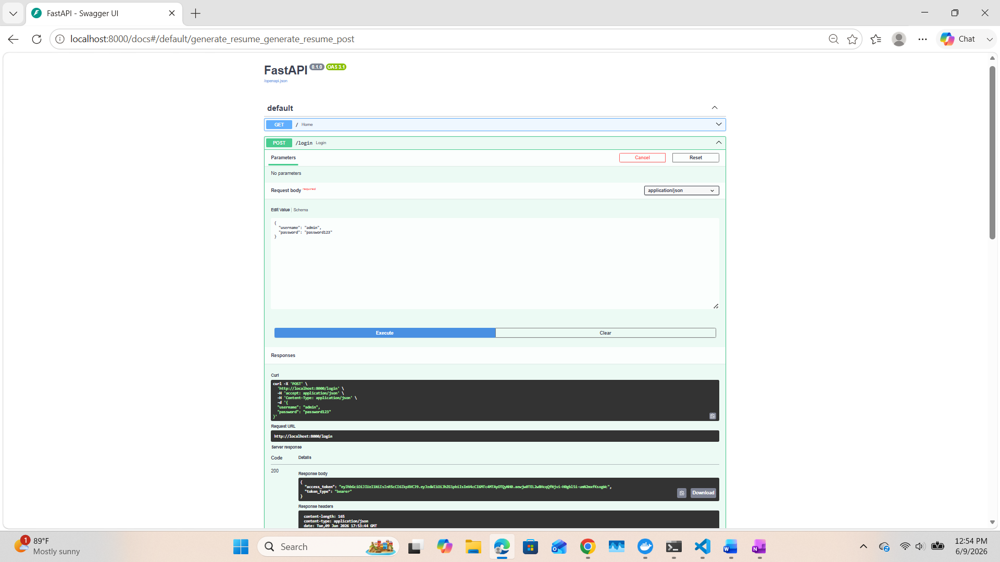
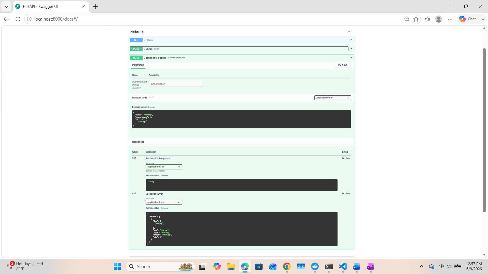
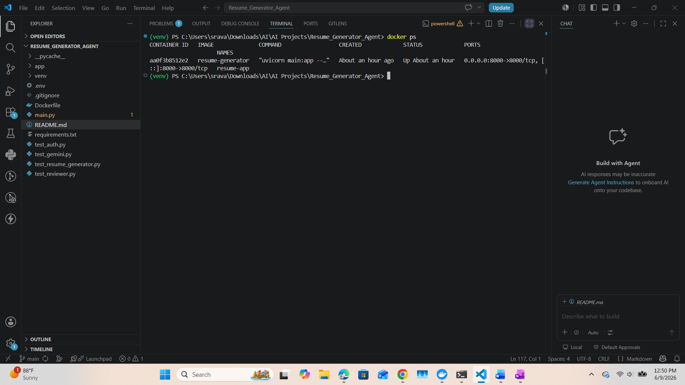

# AI Resume Generator

An AI-powered Resume Generator built using FastAPI, Gemini AI, JWT Authentication, and Docker.

## Features

* User Authentication using JWT Tokens
* Resume Generation using Gemini AI
* Resume Review Agent
* ATS Optimization Agent
* Profile Analysis Agent
* FastAPI REST APIs
* Dockerized Deployment
* Environment Variable Management using .env
* Modular Multi-Agent Architecture

## Project Highlights

- Designed a modular multi-agent architecture for resume generation and optimization.
- Implemented JWT-based authentication for secure API access.
- Integrated Gemini AI for intelligent content generation and review.
- Containerized the application using Docker for portability and deployment.
- Built REST APIs using FastAPI with interactive Swagger documentation.

## Tech Stack

* Python
* FastAPI
* Gemini AI
* JWT Authentication
* Docker
* Uvicorn
* REST APIs

## Project Architecture

User Request
     │
     ▼
JWT Authentication
     │
     ▼
Profile Analyzer Agent
     │
     ▼
Resume Writer Agent
     │
     ▼
ATS Optimizer Agent
     │
     ▼
Resume Reviewer Agent
     │
     ▼
Generated Resume Response

## API Endpoints

### Login

POST /login

Request:

```json
{
  "username": "admin",
  "password": "password123"
}
```

### Generate Resume

POST /generate-resume

Headers:

```text
Authorization: Bearer <token>
```

Request:

```json
{
  "name": "Sravani Koriginja",
  "experience": 5,
  "skills": ["Python", "AWS", "FastAPI"]
}
```

## Local Setup

```bash
git clone https://github.com/sravani-ai-cloud/AI-Resume-Generator.git

cd AI-Resume-Generator

pip install -r requirements.txt

uvicorn main:app --reload
```

### Environment Variables

Create a `.env` file:

```env
GEMINI_API_KEY=your_api_key_here
SECRET_KEY=your_secret_key_here
```

## Docker

Build Image

```bash
docker build -t resume-generator .
```

Run Container

```bash
docker run -d -p 8000:8000 resume-generator
```
### Access API Documentation

- Local Development: http://localhost:8000/docs
- Docker Container: http://localhost:8000/docs

## Screenshots

### Swagger API



### JWT Authentication



### Resume Generation API



### Docker Container



## Future Enhancements

* React Frontend
* Database Integration
* CI/CD Pipeline
* Kubernetes Deployment
* Multi-User Support
* Resume PDF Export

## Author

Sravani Koriginja

